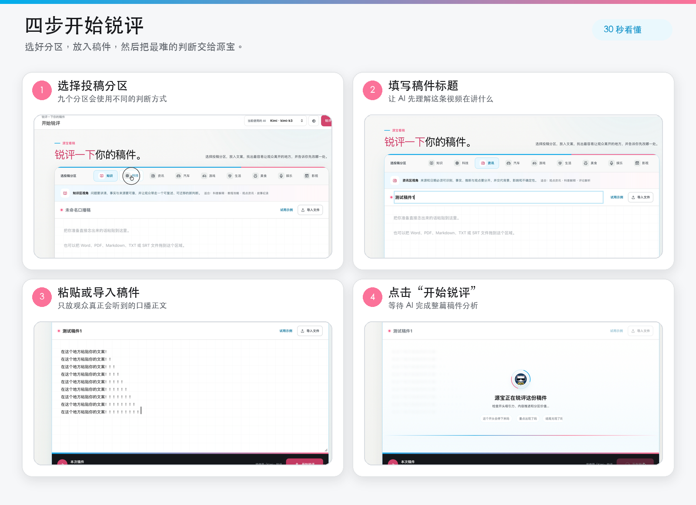

  
  <h1>源宝看稿</h1>
  
<strong>锐评一下你的稿件</strong>

  
一个用来判断你的稿件能否爆火的创作工具

  

    <a href="#下载">下载</a> ·
    <a href="#快速上手">快速上手</a> ·
    <a href="#常见问题">常见问题</a> ·
    <a href="#隐私与授权">隐私与授权</a>
  

  

    
    
    
    
  

> 选择投稿分区，放入文案，找出最容易让观众离开的地方，并告诉你先改哪一处。

> [!NOTE]
> 软件本身免费；锐评功能需要自备受支持服务商的开放平台 API Key，相关额度与费用以对应服务商规则为准。

## 它能帮你做什么

| 🎯 九个分区分别判断 | 🔎 定位原稿最大掉点 | ✍️ 只给 1–3 个优先动作 |
| :---: | :---: | :---: |
| 不拿同一套规则硬评所有内容 | 问题直接落到对应的原稿段落 | 先解决最影响观众留存的地方 |

目前支持 9 个口播内容分区：`知识` `科技` `资讯` `汽车` `游戏` `生活` `美食` `娱乐` `影视`

## 下载

当前版本：**v0.11.3**

| 系统 | 下载 | 适用范围 |
| --- | --- | --- |
| macOS 11+ | [**下载 macOS 版**](https://github.com/gityuanbao/yuanbao-kangao/releases/download/desktop-v0.11.3/YuanbaoKangao_0.11.3_macOS_Universal.dmg) | Apple 芯片与 Intel 芯片 |
| Windows 10 / 11 | [**下载 Windows 版（推荐）**](https://github.com/gityuanbao/yuanbao-kangao/releases/download/desktop-v0.11.3/YuanbaoKangao_0.11.3_Windows_x64_Setup.exe) | 64 位普通用户 |

[查看完整发布页](https://github.com/gityuanbao/yuanbao-kangao/releases/tag/desktop-v0.11.3) · [查看安装说明](https://github.com/gityuanbao/yuanbao-kangao/releases/download/desktop-v0.11.3/Install-Guide-zh-CN.txt)

<strong>管理员部署与文件校验</strong>

[Windows MSI 安装包](https://github.com/gityuanbao/yuanbao-kangao/releases/download/desktop-v0.11.3/YuanbaoKangao_0.11.3_Windows_x64_zh-CN.msi) · [SHA-256 校验文件](https://github.com/gityuanbao/yuanbao-kangao/releases/download/desktop-v0.11.3/SHA256SUMS.txt)

> 安装包暂未配置 Apple Developer ID 和 Windows 代码签名。首次打开时，系统可能显示安全提醒，请从本仓库下载并按发布页安装说明处理。

## 快速上手

第一次使用只需要 3 步。

### 1. 配置你的 AI

进入“设置”，选择 AI 服务商并粘贴对应开放平台的 API Key。绑定一次后会保存在当前电脑，之后可以快速切换。

### 2. 放入稿件，开始锐评

选择投稿分区、填写标题，再粘贴或导入观众真正会听到的口播正文。

### 3. 看懂锐评结果

先看稿件热力值，再看留存趋势、原稿批注和优先修改动作。分数只是入口，重点是知道先改哪里。

## 分数是怎么来的？

评判标准会说明分析逻辑、分区差异、三层评分结构和最终分数档位。

## 使用前要知道

- API Key 必须来自对应服务商的**官方开放平台**。
- ChatGPT 会员不等于 OpenAI API 额度；Kimi For Coding 订阅密钥也不等于 Kimi 开放平台 API Key。
- 软件会自动识别当前 Key 可用的模型，普通用户不需要手动判断具体模型版本。
- 锐评时，稿件正文会直接发送给你选择的 AI 服务商，请勿提交保密、敏感或未获授权的内容。

## 常见问题

<strong>为什么粘贴了 API Key 还是无法连接？</strong>

请先确认 Key 来自所选服务商的官方开放平台，并且账户仍有可用额度。订阅会员、网页端会员或编程产品密钥不一定能够调用开放平台 API。

<strong>每次打开软件都要重新填写 API Key 吗？</strong>

不需要。成功绑定后，Key 会保存在当前电脑；只要不删除应用数据，就可以继续使用并随时切换已经绑定的 AI。

<strong>为什么 macOS 或 Windows 第一次打开会显示安全提醒？</strong>

当前安装包尚未配置平台代码签名。请只从本仓库下载，并按照发布页中的安装说明处理。

<strong>软件会把我的稿件上传到源宝看稿服务器吗？</strong>

当前桌面版不通过源宝看稿项目服务器转发稿件。锐评时，稿件正文会直接发送给你选择的 AI 服务商。

## 隐私与授权

### 数据与隐私

- API Key、稿件历史和评分结果保存在当前电脑。
- 当前桌面版不通过源宝看稿项目服务器转发稿件。
- 完整说明见 [隐私说明](PRIVACY.md)。

### 软件授权

本仓库只提供官方安装包和使用文档，不公开应用源码、样本库、校准数据或内部研发文档。Release 页面自动生成的 `Source code` ZIP/TAR 只包含本下载仓库的文档，不是软件源码。

软件可免费下载和正常使用，但不是开源软件。不得擅自转载安装包、二次销售、冒充官方版本或反向工程；分享时请直接分享本仓库或官方发布页。

[最终用户许可协议](EULA.md) · [第三方组件说明](THIRD_PARTY_NOTICES.md)

## 反馈问题

遇到安装、API 连接或锐评异常时，请前往 [Issues](https://github.com/gityuanbao/yuanbao-kangao/issues) 提交问题。请说明操作系统、AI 服务商和错误提示，**不要粘贴完整 API Key 或未公开稿件**。

---

  <strong>源宝看稿 · 锐评一下你的稿件</strong> 
  第三方创作工具，非哔哩哔哩官方产品。

